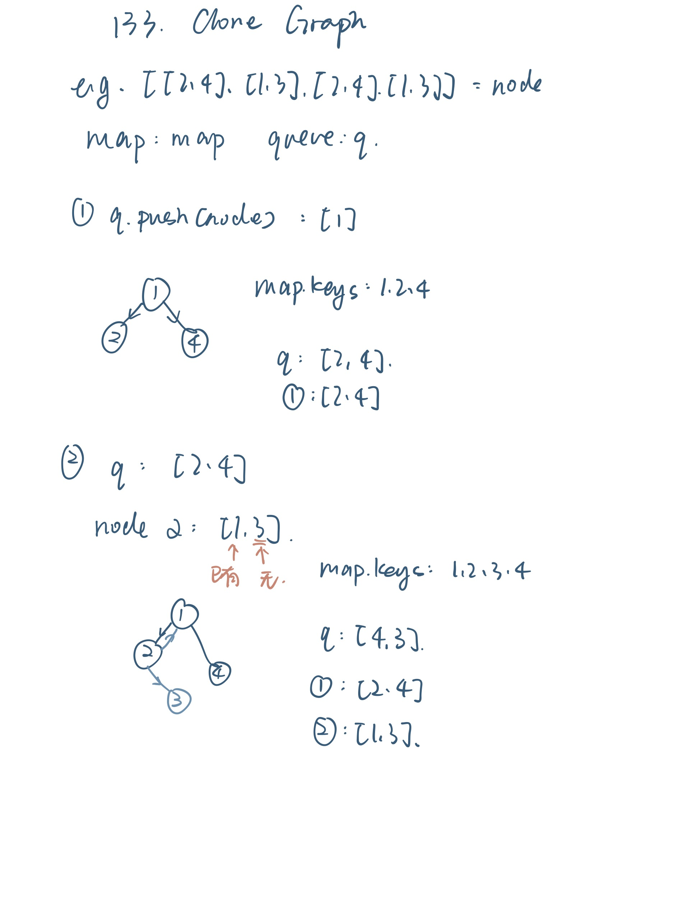
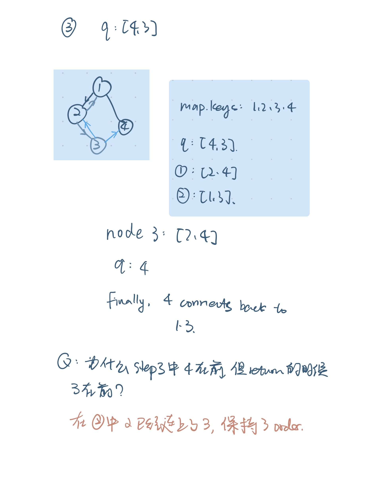

# 133. Clone Graph



```java
/*
// Definition for a Node.
class Node {
    public int val;
    public List<Node> neighbors;
    public Node() {
        val = 0;
        neighbors = new ArrayList<Node>();
    }
    public Node(int _val) {
        val = _val;
        neighbors = new ArrayList<Node>();
    }
    public Node(int _val, ArrayList<Node> _neighbors) {
        val = _val;
        neighbors = _neighbors;
    }
}
*/

class Solution {
    public Node cloneGraph(Node node) 
    {
        if (node == null)
        {
            return null;
        }
        Map<Integer,Node> map = new HashMap<Integer,Node>();
        Node ans = new Node();

        map.put(node.val,new Node(node.val));
        Queue<Node> q = new LinkedList<Node>();
        q.add(node);
        while (!q.isEmpty())
        {
            Node temp = q.poll();
            for (Node c: temp.neighbors)
            {
                if (!map.containsKey(c.val))
                {
                    map.put(c.val, new Node(c.val));
                    q.add(c);
                }
                map.get(temp.val).neighbors.add(map.get(c.val));
            }
        }
        return map.get(node.val); 
    }
}
```

* deep copy, graph主要是做了一次BFS
* 我们用map来标记到底有没有遍历过这个node
  * 如果是二叉树就没这个问题，因为二叉树是 directed
* 图片 example




